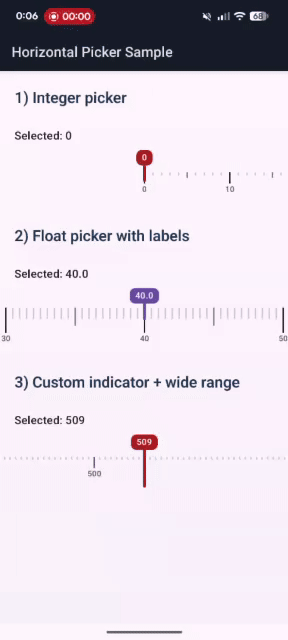

# Horizontal Picker for Jetpack Compose

Jetpack Compose 向けの横スクロール式 Picker ライブラリです。中央の固定マーカーに目盛りを合わせて、`Float` または `Int` の値を選択できます。

- Compose 専用
- minSdk `21+`
- `Float` / `Int` API を提供
- スナップ、haptic、アクセシビリティ、RTL に対応

## デモ

サンプルアプリでの操作感です。



## 導入

このリポジトリではライブラリ本体は `:picker` モジュールです。

```kotlin
dependencies {
    implementation(project(":picker"))
}
```

## 基本の使い方

### Float

```kotlin
var temperature by rememberSaveable { mutableFloatStateOf(36.5f) }

HorizontalPicker(
    value = temperature,
    onValueChange = { temperature = it },
    valueRange = 35f..42f,
    step = 0.1f
)
```

### Int

```kotlin
var age by rememberSaveable { mutableIntStateOf(30) }

HorizontalPicker(
    value = age,
    onValueChange = { age = it },
    range = 0..120,
    step = 1
)
```

## 挙動

- 1 tick = 1 step の線形 picker です。
- `value` はレンジ内に clamp され、最も近い step に snap されます。
- `onValueChange` は、中央線が目盛り中心を通過したタイミングで呼ばれます。
- 高速フリング時も、通過した step を補間して値更新と haptic を行います。
- 外部 state の反映で発生するプログラム的なスクロール中は haptic を抑制します。
- デフォルトでは `rememberSnapFlingBehavior` を使って中央にスナップします。

## カスタマイズ

### 目盛りとラベル

```kotlin
HorizontalPicker(
    value = price,
    onValueChange = { price = it },
    valueRange = 0f..1000f,
    step = 5f,
    tick = TickStyle(
        spacing = 10.dp,
        majorEvery = 10,
        mediumEvery = 5,
        majorHeight = 16.dp,
        mediumHeight = 8.dp,
        minorHeight = 4.dp
    ),
    label = LabelStyle(
        showEvery = 10,
        width = 64.dp,
        formatter = { "${it.toInt()} 円" }
    )
)
```

### センターマーカーと値バッジ

```kotlin
HorizontalPicker(
    value = amount,
    onValueChange = { amount = it },
    valueRange = 0f..100f,
    step = 1f,
    centerMarker = CenterMarkerStyle(
        color = MaterialTheme.colorScheme.error,
        stemWidth = 2.dp,
        stemHeight = 32.dp,
        showValueBadge = true
    ),
    valueBadge = { valueText, color ->
        DefaultValueBadge(
            valueText = "$valueText kg",
            color = color
        )
    }
)
```

### 端タップで 1 step 移動

```kotlin
HorizontalPicker(
    value = count,
    onValueChange = { count = it },
    range = 0..600,
    step = 1,
    edgeTapZoneFraction = 0.3f
)
```

`edgeTapZoneFraction = 0f` のときは無効です。`0.1f..0.5f` を指定すると、マーカー上部の左右端タップで 1 step ずつ移動できます。

`edgeTapZoneFraction` は、コンポーネント全体の幅に対して左右それぞれ何割を端タップ領域にするかを表します。

- `0.1f` なら左 10% と右 10%
- `0.3f` なら左 30% と右 30%
- 判定されるのはマーカー上部のオーバーレイ領域内だけです

## 主な引数

- `tick: TickStyle`
  目盛りの間隔、高さ、太さ、色、`mediumEvery`、`majorEvery` を指定します。
- `label: LabelStyle`
  ラベルの有無、表示間隔、幅、文字色、フォーマッタを指定します。
- `centerMarker: CenterMarkerStyle`
  中央マーカーの色、幅、高さ、値バッジ表示を指定します。
- `valueBadge`
  選択中の値バッジを差し替えます。引数は整形済み文字列とマーカー色です。
- `haptics`
  `null` を渡すと haptic を無効化できます。
- `flingBehavior`
  デフォルトはスナップ挙動です。独自の `FlingBehavior` を渡せます。
- `edgeTapZoneFraction`
  `0f` で無効です。`0.1f..0.5f` を指定すると、上部の左右端タップで 1 step 移動できます。
- `enabled`
  `false` でスクロールと端タップを無効化します。

## 制約と注意点

- `Float` API の `step` は `> 0f`、`Int` API の `step` は `> 0` が必要です。
- `valueRange.start <= valueRange.endInclusive` である必要があります。
- 選択可能な値は `start + n * step` です。
- `valueRange` と `step` が割り切れない場合、上限ぴったりの値は選択できないことがあります。
  例: `0f..10f` と `step = 3f` の選択値は `0, 3, 6, 9` です。
- `edgeTapZoneFraction` は `0f` または `0.1f..0.5f` で指定します。
- デフォルトの値バッジ表示は `step` に応じて小数桁数を自動決定し、最大 6 桁まで表示します。

## 公開 API

```kotlin
@Composable
fun HorizontalPicker(
    value: Float,
    onValueChange: (Float) -> Unit,
    valueRange: ClosedFloatingPointRange<Float>,
    step: Float,
    modifier: Modifier = Modifier,
    contentPadding: PaddingValues = PaddingValues(vertical = 12.dp),
    flingBehavior: FlingBehavior = PickerDefaults.SnapFlingBehavior,
    centerMarker: CenterMarkerStyle = CenterMarkerStyle(),
    valueBadge: @Composable BoxScope.(valueText: String, color: Color) -> Unit = { valueText, color ->
        DefaultValueBadge(valueText = valueText, color = color)
    },
    tick: TickStyle = TickStyle(),
    label: LabelStyle = LabelStyle(),
    haptics: HapticFeedbackType? = HapticFeedbackType.TextHandleMove,
    edgeTapZoneFraction: Float = 0f,
    enabled: Boolean = true
)

@Composable
fun HorizontalPicker(
    value: Int,
    onValueChange: (Int) -> Unit,
    range: IntRange,
    step: Int,
    modifier: Modifier = Modifier,
    contentPadding: PaddingValues = PaddingValues(vertical = 12.dp),
    flingBehavior: FlingBehavior = PickerDefaults.SnapFlingBehavior,
    centerMarker: CenterMarkerStyle = CenterMarkerStyle(),
    valueBadge: @Composable BoxScope.(valueText: String, color: Color) -> Unit = { valueText, color ->
        DefaultValueBadge(valueText = valueText, color = color)
    },
    tick: TickStyle = TickStyle(),
    label: LabelStyle = LabelStyle(formatter = { it.roundToInt().toString() }),
    haptics: HapticFeedbackType? = HapticFeedbackType.TextHandleMove,
    edgeTapZoneFraction: Float = 0f,
    enabled: Boolean = true
)
```
